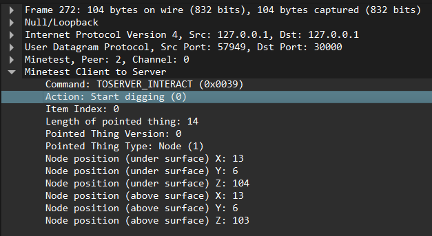
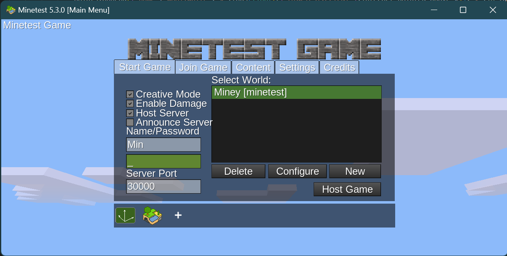
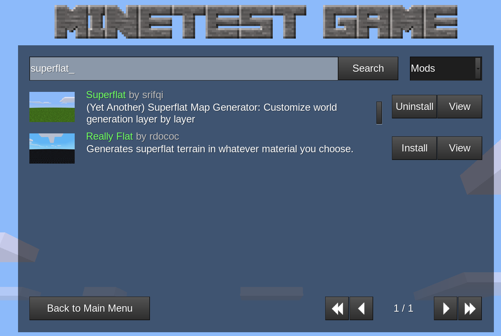
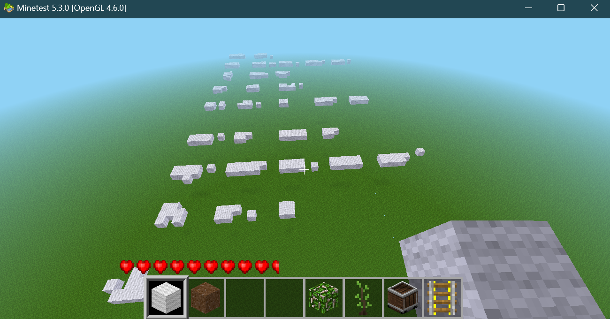

# pcap-busters-2 

## prompt - This time you ran across their activities in an illegal game server using a suspicious protocol, analyze the pcap and get the flag!!


## Analyzing the pcap

By analyzing the file we wont get any hints 

But from the prompt, it is ssaid that the UDP streamis a game protocol...
and keywords like fancy_bed_bottom,whitedirtacacia_bush_leaves

it appears like a minecraft protocol, but its minetest...

There is a .lua  Wireshark plugin available on internet for decoding the protocol...


### [Documentation](https://github.com/minetest/minetest/blob/master/util/wireshark/minetest.lua) and [installation guide](https://stackoverflow.com/questions/27978243/adding-plugin-for-a-custom-protocol-into-wireshark)

This plugin will help decode the protocol:



There are 6 type of actions relayed:
```

        [0] = "Start digging",
		[1] = "Stop digging",
		[2] = "Digging completed",
		[3] = "Place block or item",
		[4] = "Use item",
		[5] = "Activate held item",
```

```python

import pyshark
import json 
from math import fabs

cap=pyshark.FileCapture("D:\ctfdump/game.pcap")
points=[]

for c  in cap:
	try:
		if str(c["MINETEST.CLIENT"].command)=="0x0039":
			if str(c["MINETEST.CLIENT"].interact_action) in ["0","1","2"]:
				print(f"add block at x =",c["MINETEST.CLIENT"].interact_pointed_above_x," y = ",c["MINETEST.CLIENT"]._get_all_fields_with_alternates()[-2].show," z = ",c["MINETEST.CLIENT"]._get_all_fields_with_alternates()[-1].show)
#place a block of brick so as to differentiate from surroundings
				points.append({"name":"wool:white","x":fabs(float(c["MINETEST.CLIENT"].interact_pointed_above_x)),"y":10*fabs(float(c["MINETEST.CLIENT"]._get_all_fields_with_alternates()[-1].show)),"z":fabs(float(c["MINETEST.CLIENT"]._get_all_fields_with_alternates()[-2].show))})			
			elif str(c["MINETEST.CLIENT"].interact_action) in ["3"]:
				print(f"remove block at x =",c["MINETEST.CLIENT"].interact_pointed_above_x," y = ",c["MINETEST.CLIENT"]._get_all_fields_with_alternates()[-2].show," z = ",c["MINETEST.CLIENT"]._get_all_fields_with_alternates()[-1].show)
#place a block of air to remove a block
				points.append({"name":"wool:white","x":float(c["MINETEST.CLIENT"].interact_pointed_above_x),"y":float(c["MINETEST.CLIENT"]._get_all_fields_with_alternates()[-2].show),"z":float(c["MINETEST.CLIENT"]._get_all_fields_with_alternates()[-1].show)})			
	except:
		pass 


with open("pcap3.json","w") as outfile:
	json.dump(points,outfile)

```

This code saves points in a json file

## Plotting the Coordinates

Now to plot and automate plotting the points, there is a python library Miney 

[Miney Documentation](https://miney.readthedocs.io/en/latest/objects/Node.html)

It will come along with the minetest distribution.

Launch "miney_launcher.exe"

Start minetest

Start python idle



### Its better to install Superflat(flat world) mod to better plot the coordinates on a flat empty map.



now, load the pts.py script in the python IDLE:
```python
import miney
import json

#connect 
mt=miney.Minetest()

#load node coordinates on the map
with open("pcap3.json","r") as infile:
	pts=json.load(infile)

mt.node.set(pts)
```
### After plotting the coordinates, it will appear as:



it seems lil bit unintelligible but its a morse code and after tinkering a bit, you will get the flag


Flag : pearl{M0RS3_C0DE}


