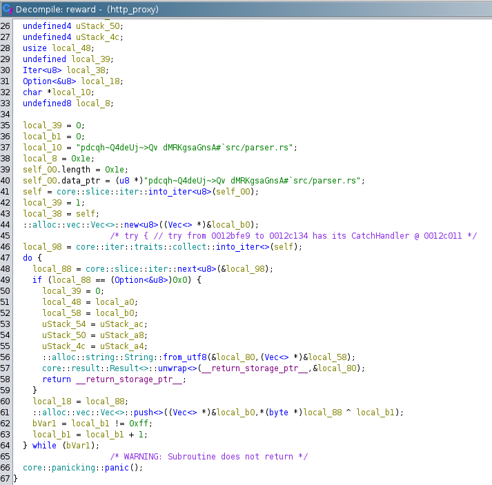

# rusty proxy
## Solution
following the steps in [rusty proxy again](https://github.com/Atish03/PearlCTF_writeup/tree/main/web/rusty_proxy_again#rusty-proxy-again), we find a `reward` function.



Analysing the function, we see that the string is xored with its index to give the final flag.

```
>>> s = ""pdcqh~Q4deUj~>Qv dMRKgsaGnsA#`"
>>> "".join([chr(ord(s[i]) ^ i) for i in range(len(s))])
```

## Flag
`pearl{W3ll_ar3_y0u_A_rev_wiZ?}`