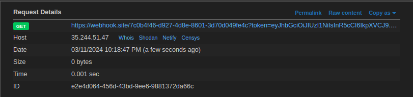

# learn HTTP final
## Solution
We can produce any HTTP response, just url-encode it and pass to the input to get the url to produce your HTTP response.

Here, the XSS is found in `/learn` (innerHTML is set as cookie) but the bot visits `/resp`, so we need to make a payload such that it will set the cookie and change it's location to learn.

```
HTTP/1.1 302 OK
Set-Cookie: name=
Location: http://localhost:5000/learn


```



We get the token in the request, after bruting the signing key, we find it as `danger`

changing the id to 2 and sigining the payload, we request to `/flag` with cookie as `token=<new_token>`, we get the flag

## Flag
`pearl{7ime_to_ch4ng3_mY_S3cr3ts}`